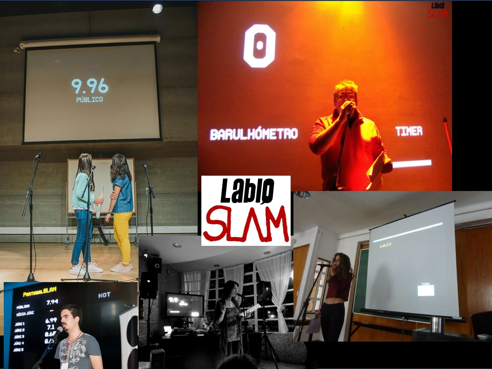

#BARULHOMETRO

Barulhometro is an application written in [Pure Data] (http://www.puredata.info) to be used at Poetry Slam events to calculate a score based on the noise level made by the audience after each poem. It also calculates the average of the human jury scores, displays a countdown timer and a default image of the event.

For  people who don't know how to handle Pd it is available as a piece of hardware (RaspberryPi) that just needs to be plugged into AC and a video projector and it is up and running. User can control it simply through a web browser of any device connected to the WiFi net that the RaspberryPi itself sets up (see video tutorial).

At present it is in Portuguese and English. Any language can be quickly costumized, as well as  other items like display image, logo, introduction of slammers names, general colors, display or not of the colorfull moving rectangle when the barulho/noise is being calculated and so on.

##INSTALLATION

* Linux
  * [Download and install Pure Data] (http://www.puredata.info/docs/faq/debian)
  * Install Git. typing in your terminal `sudo apt-get install git` works on Debian based, like Ubuntu.
  * Get the Barulhometro. Typing this in your terminal `git clone https://github.com/LabIO/barulhometro`
    or click the download button down on the right
  * Enter the directory "barulhometro" `cd barulhometro/` and run the script "slam_setup.sh" `./slam_setup.sh`

* Windows
Not tried yet but should work.

* Mac OSX
Not tried yet but should work.

##USAGE

* Check noise level of Silence (click on the button "Check Silence")
* Set it in the number box below (if different than 60Db...)
* Create the GEM window in the slamcomplete.pd patch (choose the dimension you prefer)
* CALIBRATION (set the maximum noise level corresponding to the value 10)
  * In the interface window click on Barulho   
  * Make noise for 5 seconds!!!
  * In the barulhometro window click on the green button "set_value_10"
  * Use the radio button to control the Timer, Barulhometro and Jury Count

##TECHNICAL REQUIREMENTS

A computer with Pd, a microphone and a video projector. 

##Video TUTORIAL

https://youtu.be/mPs9cOwZWu4

##LINKS

https://youtu.be/Tv19viEMy3g

##LICENSE

This software follows the GNU General Public License v3.0.
